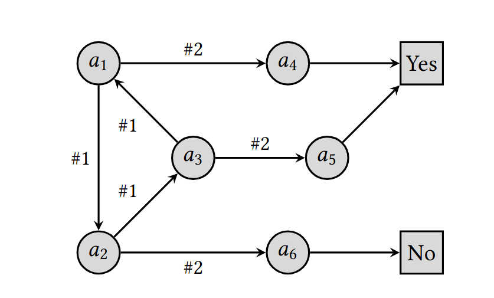
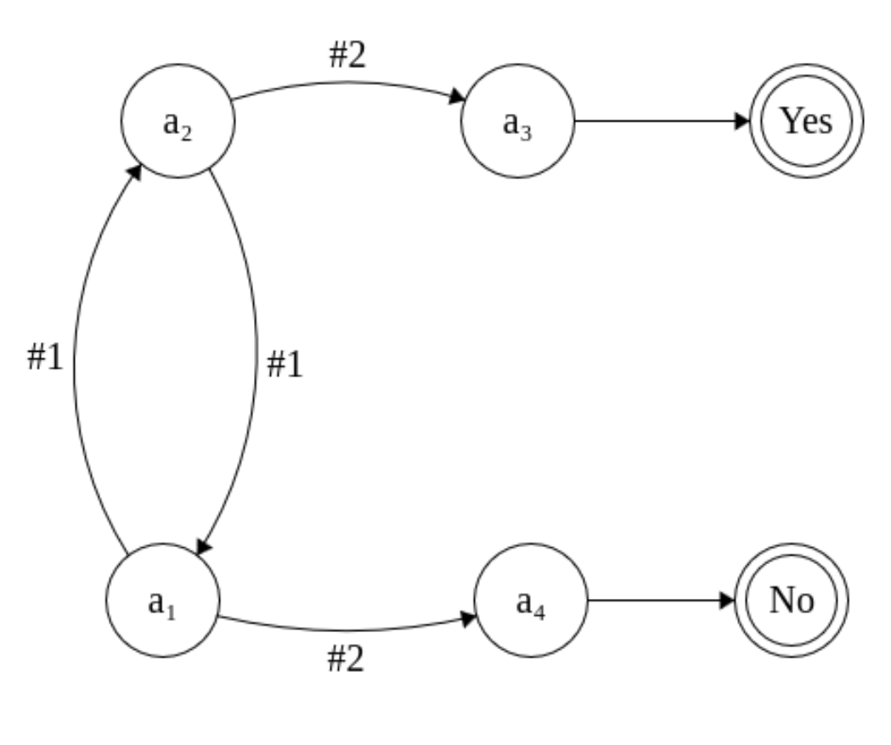
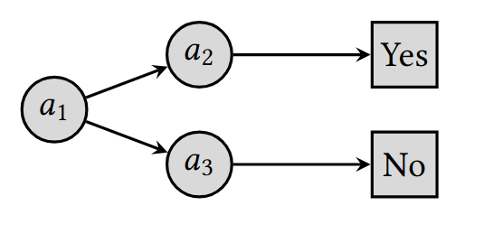

# Theorems

Some of the information on this page may be repeated elsewhere.

### Theorem 4.1.

No mechanism using one neighbor preferences, multiple ranked prefences, or multiple unranked preferences can satisfy both the right to delegate and capped power for any cap less than the number of agents n.

**Proof:** The paper notes that this property can be clearly observed with two agents, as a cap of less than two will not allow either of them to delegate to the other. This can be generalized by noting that for any cap m, a profile can be constructed where m voters voted for each of (n-1)/m candidates, thereby not allowing the remaining voter from delegating without exceeding the cap.

### Theorem 5.1.

Any tally algorithm which must delegate each agent’s vote to its highest ranked neighbor through which a delegation path exists, only allows simple paths, and guarantees that the vote will eventually reach a voter, cannot satisfy 1-path explainability.

**Proof:** Brubach, Ballarin, and Nazeer present the following delegation graph as a counterexample.

Here is an even more minimal example:

$a_1$'s vote must be delegated to $a_2$, as the algorithm "must delegate each agent’s vote to its highest ranked neighbor through which a delegation path exists". From there, there is only one simple path by which it may reach a voter, by delegating it to $a_3$. Similarly, $a_2$'s vote must be delegated to $a_1$, from which it must be delegated to $a_4$, who votes. Thus, the vote which is delegated to $a_1$ follows a different path than $a_1$'s own vote, and the algorithm cannot satisfy 1-path explainability.

**Theorem 5.2. No deterministic mechanism with multiple unranked preferences can simultaneously satisfy the right to delegate, single-path explainability, and no arbitrary decisions.

Proof: Brubach, Ballarin, and Nazeer present the following delegation graph as a counterexample.

As $a_2$ and $a_3$ are indistinguishable, and $a_1$ must be able to delegate their entire vote to either $a_2$ or $a_3$, the algorithm must make an arbitrary decision.
